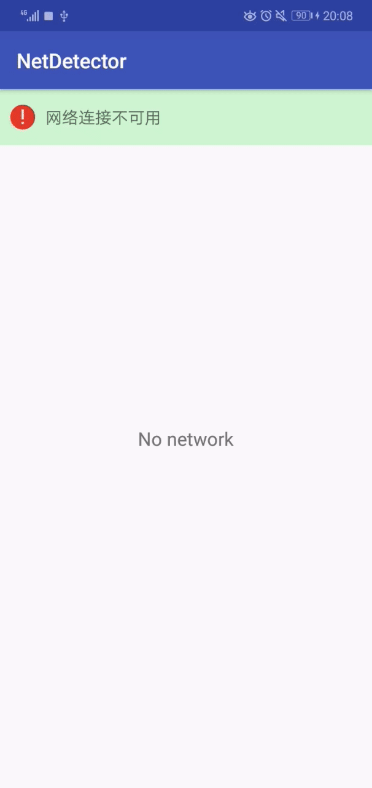

# NetDetector
* 通过使用BroadcastReceiver来检测Android设备网络变化的库,这里基于[tianma8023/NetDetector: A simple library that can detect network state changes on Android device. / 通过使用BroadcastReceiver来检测Android设备网络变化的库 ](https://github.com/tianma8023/NetDetector)
* 该库的使用： [使用教程](./该库的使用.md)
* 源码介绍请移步 [原理分析&源码介绍](./introduction.md)
* Apk体验链接：[app-release.apk](./apk/app-release.apk)

## 效果图



## 背景
* 无论是Android/iOS移动端还是Web前端，对网络都是非常重视。网络权限，虽然不属于危险
权限，但它也挺复杂的。比如用户在使用的过程中断开网络，这里就可以自定义配置OkHttp缓存；
比如由于版本问题，连通了之后不能上网；比如点击打开了wifi按钮，网络畅通，发现ping无效...

* 公司产品给出了一个需求：网络畅通时加载数据，网络不畅通时加载数据，网络恢复之后实现重连。
一般网络就有三种和情况（wifi/4g是为同一种，都是上网工具）：
  * 网络未开启（wifi/4g按钮都不开启）或者网络开启情况下没有可用wifi/移动网络（wifi/4g都开启了，但没有可用网络）
    ，总之就是不可以上网
  * 网络畅通，可以上网
  * 网络开启了，链接了Wifi/4g但不可以上网，这里很多人都建议ping www.baidu.com ，
    这里我发现效果并不理想，所以我建议直接访问公司的网络，然后做判断->推荐使用
    RxJava + Retrofit(自定义OkHttp)请求网络
* 这里库只讨论上面两点的第一小点跟第二小点


### 错误
* 网络最新的一片文章便是“觉得低于Android N(24)的就使用BroadcastReceiver，高于Android N(24)
就是用JobScheduler”(理由：Android 7.0 为了后台优化，推荐使用 JobScheduler 代替 BroadcastReceiver 来监听网络变化。)，
比如下面这种写法,下面这种写法在华为M5上不起作用（M5 Emui8.0基于Android 8.0）:
```
    @SuppressLint("NewApi")
    private void networkCallback() {
        if (Build.VERSION.SDK_INT < Build.VERSION_CODES.N) {
            mNetReceiver = new NetReceiver();
            IntentFilter intentFilter = new IntentFilter(ConnectivityManager.CONNECTIVITY_ACTION);
            registerReceiver(mNetReceiver, intentFilter);
            return;
        }


        //https://www.jianshu.com/p/83da8f88ce9c
        final ConnectivityManager connectivityManager = (ConnectivityManager) getSystemService(Context.CONNECTIVITY_SERVICE);
        if (connectivityManager == null) {
            return;
        }
        connectivityManager.requestNetwork(new NetworkRequest.Builder().build(), new ConnectivityManager.NetworkCallback() {
            @Override
            public void onLost(Network network) {
                super.onLost(network);
                ///网络不可用的情况下的方法
            }

            @Override
            public void onAvailable(Network network) {
                super.onAvailable(network);
                ///网络可用的情况下的方法
                loadWebUrl();
            }
        });
    }


    public class NetReceiver extends BroadcastReceiver {
        @Override
        public void onReceive(Context context, Intent intent) {
            // TODO Auto-generated method stub
            ConnectivityManager manager = (ConnectivityManager) context.getSystemService(Context.CONNECTIVITY_SERVICE);
            if (manager == null) {
                return;
            }

            NetworkInfo mobileInfo = manager.getNetworkInfo(ConnectivityManager.TYPE_MOBILE);
            NetworkInfo wifiInfo = manager.getNetworkInfo(ConnectivityManager.TYPE_WIFI);
            if (wifiInfo != null && (wifiInfo.isConnected() || mobileInfo.isConnected())) {
                loadWebUrl();
            }
        }

    }
```

### 同等优秀的库
* [GHdeng/NetMonitor: 使用广播监听网络变化更新UI ](https://github.com/GHdeng/NetMonitor)
  * 这个库也很好，也推荐伙伴们去使用哈。
* [[23]—— 10分钟让你实现在APP中对网络状态变化进行全局提示 - 简书 ](https://www.jianshu.com/p/aa3a39dcc3af)
